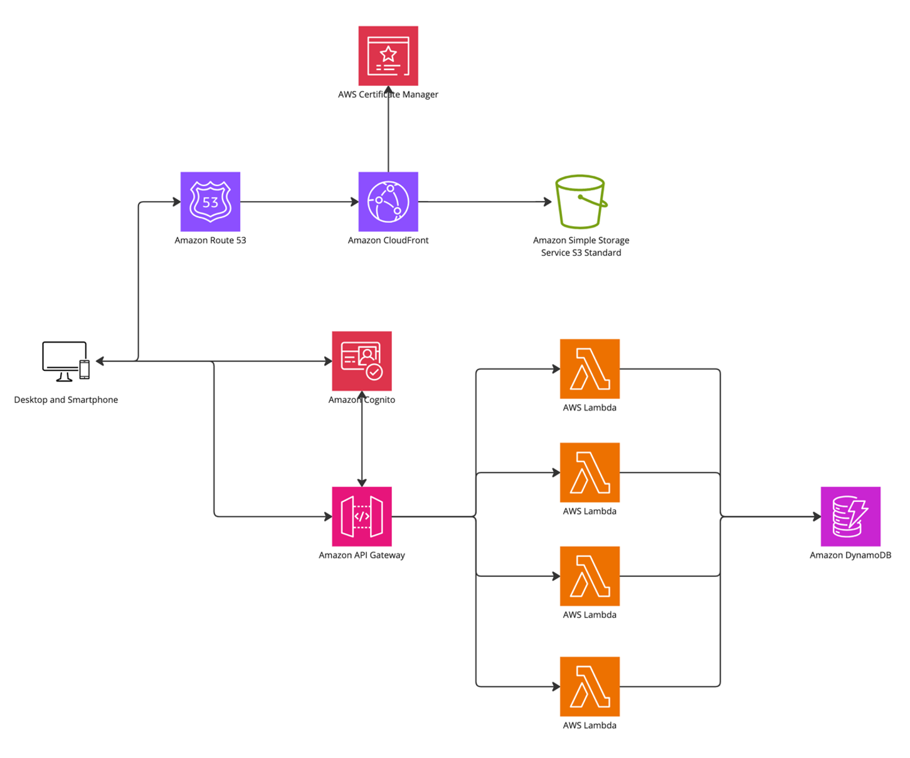

# Reference Project Implementation of SOLID Principles in CDK IaC
This repository demonstrates the application of SOLID Object-Oriented Programming (OOP) principles to Infrastructure-as-Code (IaC) using AWS CDK. It includes a comprehensive application stack, complete with a frontend, backend, and infrastructure services.

## Project Overview

This project showcases the use of OOP design principles (e.g., SOLID) to address maintainability challenges in IaC code. The repository contains:

- A frontend web application (Angular)
- Backend services implemented as AWS Lambda functions
- Infrastructure deployed using AWS CDK

Key features include modular constructs, reusable configurations, and environment-specific deployment strategies.

### Architecture:


## Folder Structure

```plaintext
oop-iac-main/
├── application/
│   ├── frontend/         # Angular-based frontend application
│   ├── functions/        # AWS Lambda functions
│   │   ├── add-item/     # Function for adding items
│   │   ├── get-items/    # Function for fetching items
│   │   ├── shared-code/  # Shared code for Lambda functions
├── cdk/                  # AWS CDK infrastructure code
│   ├── lib/constructs/   # Reusable constructs
│   ├── lib/stacks/       # CDK stacks
│   ├── lib/stages/       # Environment-specific stages
├── README.md             # Project documentation
```
### Prerequisites

Ensure you have the following tools installed:

- [Node.js](https://nodejs.org/) (v14 or later)
- [AWS CDK](https://aws.amazon.com/cdk/) (v2 or later)
- [Angular CLI](https://angular.io/cli)
- [AWS CLI](https://aws.amazon.com/cli/) (configured with appropriate credentials)

### Installation

1. Clone the repository:

   ```bash
   git clone https://github.com/your-repo-url.git
   cd oop-iac-main
2. Install dependencies and build the application:

   ```bash
    npm run build
3. Synthesize the Cloudformation Markup from CDK:
- Configure the `env:account` properties for each of the Stage classes in cdk/bin/cdk.ts file.
    ```bash
    cd cdk
    npm run cdk synth
4. Deploy the CDK to an AWS Environment
- Bootstrap an appropriate AWS environemnt for CDK
- Configure AWS CLI with appropriate credentials
- Then run: 
    ```bash
    cd cdk
    npm run deploy
